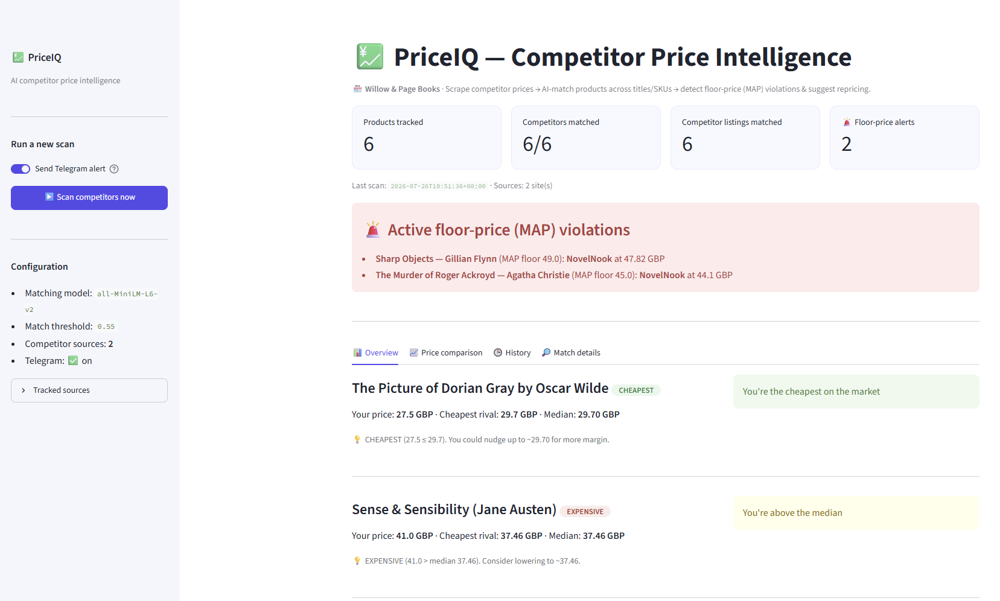

# PriceIQ — AI Competitor Price Intelligence

> Scrape competitor prices from anti-bot storefronts, **match products across different names/SKUs with AI**, and surface pricing position, repricing suggestions, and **MAP (minimum-advertised-price) violation alerts** — as a CLI, a dashboard, and a REST API.



PriceIQ is not a "price scraper". A scraper gives you a spreadsheet. PriceIQ gives you a **decision**: *are competitors undercutting my floor price right now, and what should I do about it?*

---

## Why it's different

Most price-tracking gigs break on one hard problem: **the same product is listed under a different title in every store.** "A Study in Scarlet (Sherlock Holmes #1)" vs "A Study in Scarlet: A Sherlock Holmes Mystery" vs "Study in Scarlet, A". Exact-string matching misses them; manual matching doesn't scale.

PriceIQ matches products by **meaning** using local sentence-embeddings (cosine similarity), so it links listings that no keyword match would catch — with a confidence score on every match, and a human-in-the-loop review surface rather than a black box.

| | Typical scraper gig | **PriceIQ** |
|---|---|---|
| Output | CSV of raw prices | Position + suggestion + MAP alerts |
| Product matching | Exact title / manual | **AI semantic match + score** |
| JS / anti-bot sites | Often fails | Playwright headless browser |
| Delivery | One-off script | CLI **+ dashboard + API + Docker** |
| Monitoring | — | Scheduled scans + Telegram alerts |

---

## Features

- **Anti-bot scraping** — two techniques in one pipeline: `requests + BeautifulSoup` for static HTML, **Playwright (headless Chromium)** for JavaScript-rendered stores.
- **AI product matching** — `sentence-transformers` (all-MiniLM-L6-v2) embeddings + cosine similarity; runs **locally, no API key, no per-call cost**. Every match carries a 0–1 confidence score.
- **Pricing analysis** — for each of your products: cheapest competitor, median, your position (`cheapest / mid / expensive`), and a concrete repricing suggestion. Rule-based, deterministic, explainable.
- **MAP-compliance monitoring** — flags any competitor selling below your brand's floor price. This is the feature brands pay a **monthly retainer** for.
- **Three surfaces** — a `run.py` CLI, a **Streamlit dashboard**, and a **FastAPI** service (`/scan`, `/report`, `/alerts`).
- **Alerting** — optional Telegram push when a MAP violation appears.
- **Packaged** — Dockerfile + docker-compose, unit tests, config-driven catalog.

---

## Architecture

```
                config.json  (your catalog + competitors + MAP floors)
                     │
   ┌─────────────────▼──────────────────┐
   │  sources.py   scrape competitors     │  requests+bs4  |  Playwright
   │               → [Listing(name, price)]                │
   ├──────────────────────────────────────┤
   │  matching.py  AI semantic match       │  sentence-transformers
   │               your catalog ↔ listings │  cosine similarity + score
   ├──────────────────────────────────────┤
   │  analyze.py   position + suggestion   │  rule-based, explainable
   │               + MAP violation flag    │
   ├──────────────────────────────────────┤
   │  storage.py   history.csv + snapshot  │
   └───────┬──────────────┬────────────────┘
           │              │
      run.py CLI     app.py dashboard      api.py  (FastAPI)
      + Telegram     (Streamlit)           /scan /report /alerts
```

---

## Quickstart

```bash
# 1. install
python -m venv .venv && .venv\Scripts\activate      # Windows
pip install -r requirements.txt
playwright install chromium                          # one-time browser download

# 2. configure
copy config.example.json config.json                 # edit your catalog + competitors

# 3a. run a scan from the CLI
python run.py                                         # scrape → match → analyze → report
python run.py --no-telegram                           # skip alerts

# 3b. open the dashboard
streamlit run app.py                                  # http://localhost:8501

# 3c. run the API
uvicorn api:app --host 0.0.0.0 --port 8000           # http://localhost:8000/docs
```

### Docker

```bash
docker compose up --build      # dashboard :8501  +  api :8000
```

---

## The config

```jsonc
{
  "store_name": "Willow & Page Books",
  "embedding_model": "all-MiniLM-L6-v2",
  "match_threshold": 0.55,                     // cosine cutoff for "same product"
  "telegram": { "bot_token": "...", "chat_id": "..." },
  "competitors": [
    { "name": "PageTurner Books", "type": "books_toscrape",  "url": ".../classics...", "max_pages": 1 },
    { "name": "NovelNook",        "type": "books_playwright", "url": ".../mystery...",  "max_pages": 1 }
  ],
  "my_catalog": [
    { "sku": "DORIAN", "name": "The Picture of Dorian Gray by Oscar Wilde", "my_price": 27.50, "map_price": 26.0, "currency": "GBP" }
  ]
}
```

> `books_toscrape` scrapes static HTML; `books_playwright` scrapes the same shop through a **real headless browser** — the path a JS-rendered / anti-bot store needs.

Add a competitor by writing a small fetcher in `sources.py` and registering it in `FETCHERS` — the analysis layer is source-agnostic.

---

## API

| Method | Path | Description |
|---|---|---|
| `GET`  | `/health` | Liveness probe |
| `GET`  | `/report` | Latest persisted scan (fast, no re-scrape) |
| `GET`  | `/alerts` | Only products currently violating MAP |
| `POST` | `/scan`   | Run a fresh scan now, persist + return |

Interactive docs at `/docs` (Swagger UI, auto-generated).

---

## Testing

```bash
python -m pytest -q
```

The core pricing/MAP logic is covered by deterministic unit tests (no network, no model download).

---

## Legal & ethical scope

This demo scrapes a **public sandbox site built for scraping practice** (`books.toscrape.com`) via two techniques — never a live retailer. In production, PriceIQ is designed to:

- collect **prices and product data only** (non-personal — outside GDPR's scope), never personal/review data;
- respect each target's `robots.txt`, rate limits, and Terms of Service;
- operate on sources the client is authorized to monitor.

**On accuracy:** AI matching is strong but not infallible on ambiguous titles. PriceIQ ships every match with a confidence score and a review surface — it augments a human decision, it doesn't replace one. Realistic accuracy on clean catalogs is ~90–95%, with low-confidence matches flagged for review.

---

## Tech stack

Python · Playwright · BeautifulSoup · sentence-transformers · pandas · Streamlit · Altair · FastAPI · Docker · pytest

---

## License

© 2026 **thangtv968** — all rights reserved. Published as a **portfolio showcase, for evaluation only**; not licensed for reuse or redistribution (see [`LICENSE`](LICENSE)). The full production engine — additional competitor adapters, scheduling, hardening and client onboarding — is maintained privately and provided to clients under a separate agreement.

---

*Built as a portfolio flagship for automation + AI data-intelligence work.*
